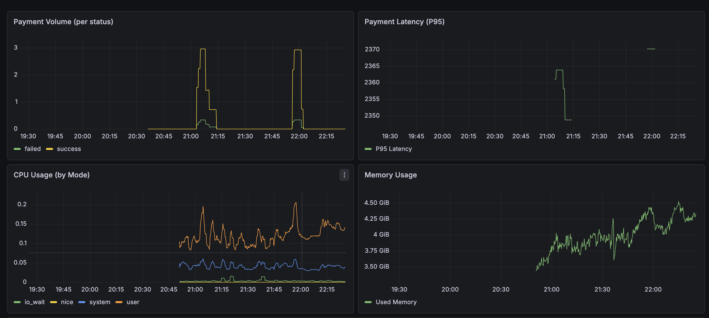
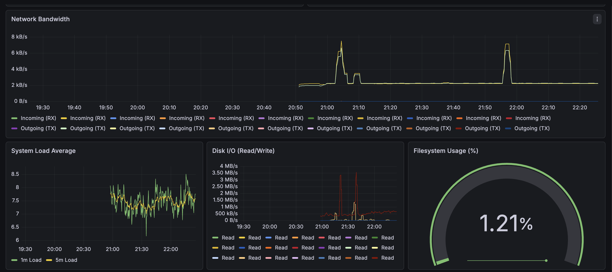
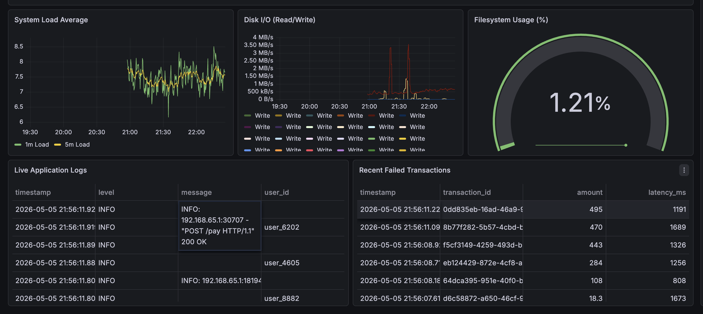
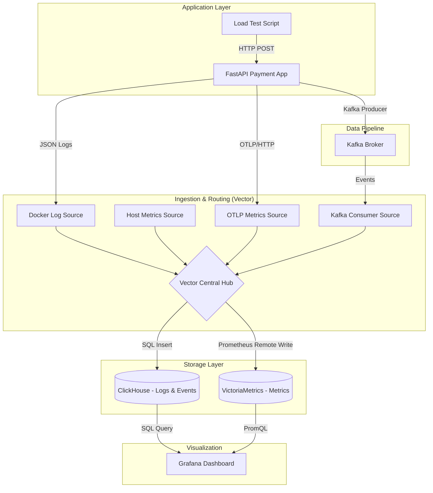
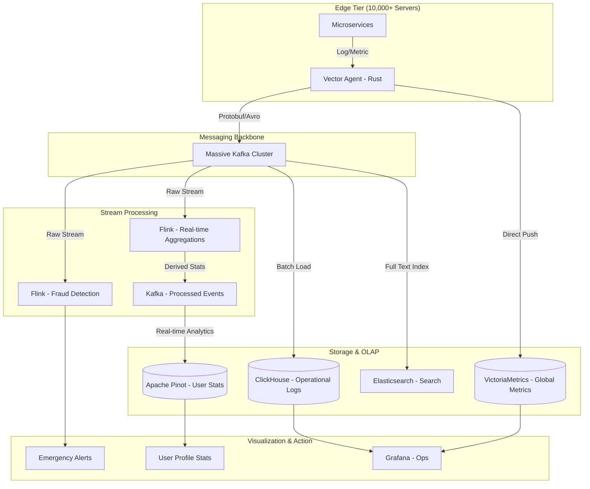

# 🚀 Observability Sandbox: Payment Gateway Pipeline

A production-grade observability sandbox designed to monitor a containerized FastAPI payment gateway. This project demonstrates a "multi-signal" telemetry approach using modern industry-standard tools for logs, metrics, and business events.


## 📊 Dashboard Gallery
Experience the live telemetry pipeline in action.


*Full System Visibility: Logs, Metrics, and Business Events.*


*Real-time Application Logs and Transaction Tracing.*


*Deep-dive Infrastructure Health: CPU, Memory, and Disk I/O.*

## 🏗️ Architecture: Sandbox Version
This is the architecture currently running in this repository.



---

## 🌎 Architecture: "LinkedIn" Scale (Future Growth)
How this system evolves when scaling to 10,000+ servers.



---

## 🚀 Scaling to the Enterprise: The Role of Apache Flink

As the system grows from a sandbox to a global platform (like LinkedIn or Uber), simple data routing isn't enough. This is where **Apache Flink** enters the pipeline as the "Stateful Brain."

### What Flink adds to the Pipeline:
While **Vector** is a high-speed router (Stateless), **Flink** is a complex processor (Stateful). It allows you to:

*   **Real-time Fraud Detection**: Identify suspicious patterns (e.g., "User paying from NYC and London within 5 minutes") by maintaining state across thousands of events.
*   **Complex Windowing**: Calculate rolling metrics that don't exist in the raw data, such as "Average Transaction Value per city over the last 15 minutes."
*   **Dynamic Alerting**: Trigger emergency notifications directly from the stream based on complex logic (e.g., "Alert if success rate drops below 95% only for users on iOS").
*   **Stream Joining**: Enrich incoming payment logs with user metadata from a separate "Customer Info" stream in real-time.

### 📈 Data Choice & Quantification (The "Why")

At LinkedIn scale, one database cannot do everything. We choose specialized tools based on their performance "sweet spots":

| Database | Throughput | Query Latency | Primary Use Case |
| :--- | :--- | :--- | :--- |
| **ClickHouse** | **100M+ logs/sec** | < 1 second | **Internal Ops**: Analyzing trillions of logs to find bugs. |
| **Apache Pinot** | **200k+ QPS** | **< 50ms** | **User-Facing**: The "Who viewed your profile" chart. |
| **VictoriaMetrics**| **1M+ samples/sec**| < 200ms | **Infra Health**: Monitoring 10,000+ servers' CPU/RAM. |
| **Kafka** | **TB/hour** | N/A | **The Backbone**: Moving data between all of the above. |

### 🪟 Complex Windowing in Flink
Flink's superpower is its ability to perform calculations on a "slice" of time. Here is how we use it:

1.  **Tumbling Windows (Fixed Size)**: 
    - *Example*: "Total failed payments every 5 minutes."
    - *Usage*: Use this for clean, non-overlapping hourly or daily reports.
2.  **Sliding Windows (Overlapping)**:
    - *Example*: "Average latency of the last 10 minutes, updated every 30 seconds."
    - *Usage*: Perfect for smooth monitoring graphs that catch spikes quickly.
3.  **Session Windows (Gap-based)**:
    - *Example*: "Group all events from a user until they are inactive for 30 minutes."
    - *Usage*: Crucial for analyzing "User Journeys"—seeing exactly what a user did from login to purchase.

### 📚 Deep Dive References
- **[Apache Flink: Windowing Documentation](https://nightlies.apache.org/flink/flink-docs-stable/docs/dev/datastream/operators/windows/)** - The official guide to stateful time processing.
- **[ClickHouse vs. Pinot vs. Druid](https://altinity.com/blog/clickhouse-vs-pinot-comparison/)** - A deep comparison of real-time OLAP databases.
- **[The Log: What every software engineer should know about real-time data's unifying abstraction](https://engineering.linkedin.com/distributed-systems/log-what-every-software-engineer-should-know-about-real-time-datas-unifying)** - The famous LinkedIn article that explains the philosophy behind this architecture.

---

## 🛠️ Tech Stack

| Component | Technology | Purpose |
| :--- | :--- | :--- |
| **App** | FastAPI (Python) | High-performance payment gateway simulation. |
| **Data Router** | Vector (Rust) | Lightweight, fast telemetry collector and router. |
| **Messaging** | Apache Kafka | Event bus for decoupled business transaction events. |
| **Log Storage** | ClickHouse | OLAP database for blazing-fast log and event queries. |
| **Metric Storage** | VictoriaMetrics | High-efficiency storage for system and app metrics. |
| **Visualization** | Grafana | Unified dashboard for all telemetry signals. |

## 🚀 Getting Started

### 1. Prerequisites
- Docker & Docker Compose
- Python 3.9+ (for load testing)

### 2. Spin up the Stack
```bash
docker compose up -d
```

### 3. Generate Traffic
Run the load test to see data flow into the dashboard:
```bash
python load_test.py
```

### 4. Access the Command Center
- **Grafana**: [http://localhost:3000](http://localhost:3000) (Admin / Admin)
- **ClickHouse Play**: [http://localhost:8123/play](http://localhost:8123/play)
- **VictoriaMetrics**: [http://localhost:8428](http://localhost:8428)

## 📊 Key Features
- **Multi-Signal Monitoring**: Correlate business events (Kafka) with operational logs (ClickHouse) and system metrics (VictoriaMetrics).
- **VRL Transformation**: Vector Remap Language used for real-time log sanitization and schema enforcement.
- **ARM64 Optimized**: Specifically configured to run smoothly on Apple Silicon (M1/M2/M3) using stable community plugins.
- **Provisioned Infrastructure**: Dashboard and data sources are pre-configured via code for instant deployment.

## 🤝 Troubleshooting
- **No Logs?**: Ensure the time range in Grafana is set to "Last 3 hours" or "Last 6 hours" to account for UTC/Local time differences.
- **Connection Refused?**: Kafka takes ~30 seconds to fully initialize its listeners. Vector will automatically retry.

---
*Built with ❤️ for modern Observability.*
